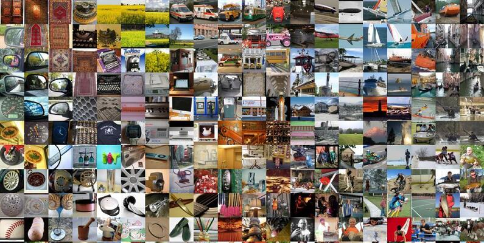

<h1 align='center' style="text-align:center; font-weight:bold; font-size:2.0em;letter-spacing:2.0px;">
                FS-BAN: Born-Again Networks for <br> Domain Generalization Few-Shot Classification</h1>
<p align='center' style="text-align:center;font-size:1.5em;">
    <a href="https://scholar.google.com/citations?user=kQA0x9UAAAAJ&hl=en" target="_blank" style="text-decoration: none;">Yunqing Zhao</a>&nbsp;,&nbsp;
    <a href="https://sites.google.com/site/mancheung0407/" target="_blank" style="text-decoration: none;">Ngai&#8209;Man Cheung</a></br>
</p>

<p align='center' style="text-align:center;font-size:1.32em;">
Singapore University of Technology and Design</br>
IEEE Transactions on Image Processing (T-IP), 2023</br>
</p>

<p align='center';>
<b>
<!-- <em>The Thirty-Sixth Annual Conference on Neural Information Processing Systems (NeurIPS 2022);</em> -->
</b>
</p>

<p align='left' style="text-align:left;font-size:1.32em;">
<b>
    [<a href="https://yunqing-me.github.io/Born-Again-FS/" target="_blank" style="text-decoration: none;">Project Page</a>]&nbsp; /&nbsp;
    [<a href="https://ieeexplore.ieee.org/document/10102807" target="_blank" style="text-decoration: none;">Paper Profile</a>]&nbsp; /&nbsp;
    [<a href="https://drive.google.com/drive/folders/1PIlO7NK8NpwLYUwT76ms_FVca1r0GKkZ?usp=sharing" target="_blank" style="text-decoration: none;">Data Repository</a>]
</b>
</p>


<!-- ---------------------------------------------------------------------- -->

Pytorch implementation for our FS-BAN for cross-domain / domain generalization few-shot classification. With the proposed born-again networks with multi-task learning, we are able to:

1. improve exisiting few-shot classification methods under **cross-domain** setting to stat-of-the-art performance
2. achieve stat-of-the-art performance under **single-domain** few-shot classification setting.


# Installation:


- Platform: Linux
- NVIDIA V100 GPUs with CuDNN 10.1
- PyTorch>=1.4.0
- lmdb, tqdm, wandb

Firstly, clone this repository:
```
git clone https://github.com/yunqing-me/Born-Again-FS.git
cd Born-Again-FS
```

You can install the libiraries through:  `pip install -r requirements.txt`. Alternatively, a suitable conda environment named `fsc` can be created and activated with:

```
conda env create -f environment.yml -n fsc
conda activate fsc
```


# Datasets



Download 5 datasets seperately with the following commands.
Set `DATASET_NAME` to either: `cars`, `cub`, `miniImagenet`, `places`, or `plantae`.

```
cd filelists
python process.py DATASET_NAME
cd ..
```

You may encounter some download issues while processing these datasets, this is due to the original dataset links were invalid. Here, we provide the [data repository](https://drive.google.com/drive/folders/1PIlO7NK8NpwLYUwT76ms_FVca1r0GKkZ?usp=sharing) to help download those datasets. Then, simply move each separate dataset `e.g., CUB_200_2011.tgz` to the corresponding folder `e.g., ./filelists/cub` and use the script to process it `e.g., write_cub_filelist.py`. 

Meanwhile, to download and process `tieredImageNet` dataset, please refer to [Torchmeta](https://github.com/tristandeleu/pytorch-meta).


# Experiments
## Feature Encoder Pretraining
we pre-train the model using a linear classifier head on training set of mini-ImageNet (64 categories).

Similar to [CrossDomainFewShot](https://github.com/hytseng0509/CrossDomainFewShot), We adopt `baseline++` for MatchingNet, and `baseline` from [CloserLookFewShot](https://github.com/wyharveychen/CloserLookFewShot) for other metric-based frameworks.

```
python train_baseline.py --method PRETRAIN --dataset miniImagenet --name PRETRAIN --train_aug
```
You can specify `--train_aug` to perform data augmentation, `--method baseline` or `--method baseline++` to decide the metric of the classifier. After pretraining, we replace the linear classifier head with different metric functions.

Alternatively, you can directly download the pretrained encoder (provieded by [CrossDomainFewShot](https://github.com/hytseng0509/CrossDomainFewShot)):
```
cd output/checkpoints
python download_encoder.py
cd ../..
```

## Training the Teacher Network 
```
cd baseline_model
bash _train_teacher.sh
```
where you can specify the model architecutre in `Conv4/Conv6/Resnet10` etc. Meanwhile, it is necessary to prepare the corresponding (pretrained) models for `--warmup` to load the pretrained weights. For each individual datasets, you need to prepare the corresponding teacher network, by specifying `--dataset`.

## FS-BAN: Born-Again Distillation for DG-FSC
```
cd fsban
bash _train_student.sh
```
where you can tune the hyperparameters in the script.

## Evaluation:
Test the metric-based framework `METHOD` on the unseen domain `TESTSET` (held-out from muliple seen source domains).

Specify the saved model (in `./output/checkpoints`) you want to evaluate with `--name` (e.g., `--name YOUR-Model-Name` from the above example).

```
python test.py --method METHOD --name NAME --dataset TESTSET
```

# Bibtex
If you find this project useful in your research, please consider citing our paper:

```
@article{zhao2023fs,
  title={Fs-ban: Born-again networks for domain generalization few-shot classification},
  author={Zhao, Yunqing and Cheung, Ngai-Man},
  journal={IEEE Transactions on Image Processing},
  year={2023},
  publisher={IEEE}
}
```

# Acknowledgement

We appreciate the wonderful base implementation of Cross-domain Few-shot Classification from [@Hung-Yu Tseng](https://github.com/hytseng0509/CrossDomainFewShot).

We especially thank for the fruitful discussion with Yiluan Guo (Motional), Jiamei Sun (Microsoft) and Milad Abdollahzadeh (SUTD).


